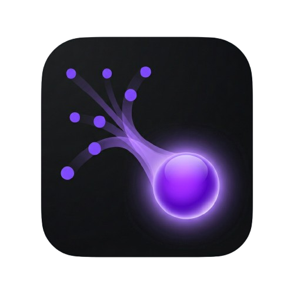
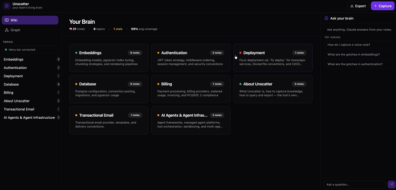
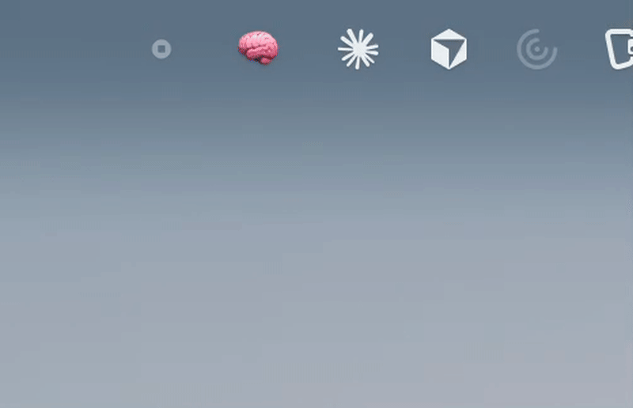
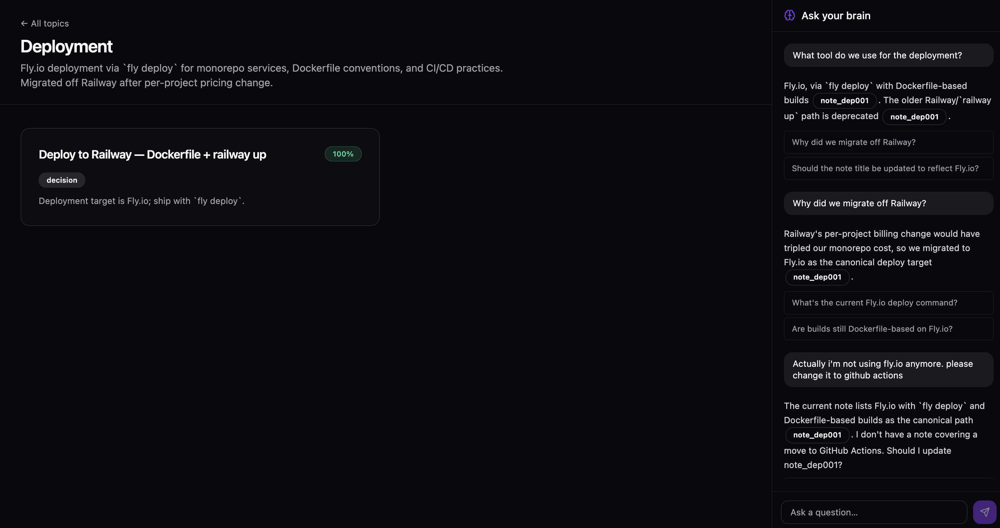
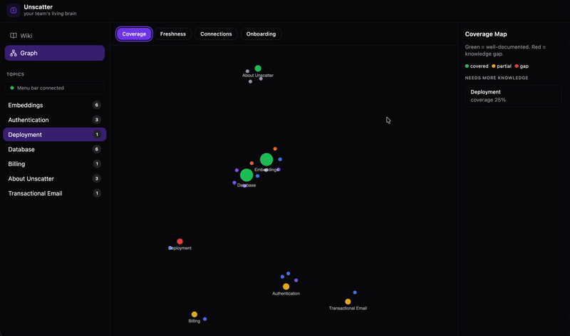
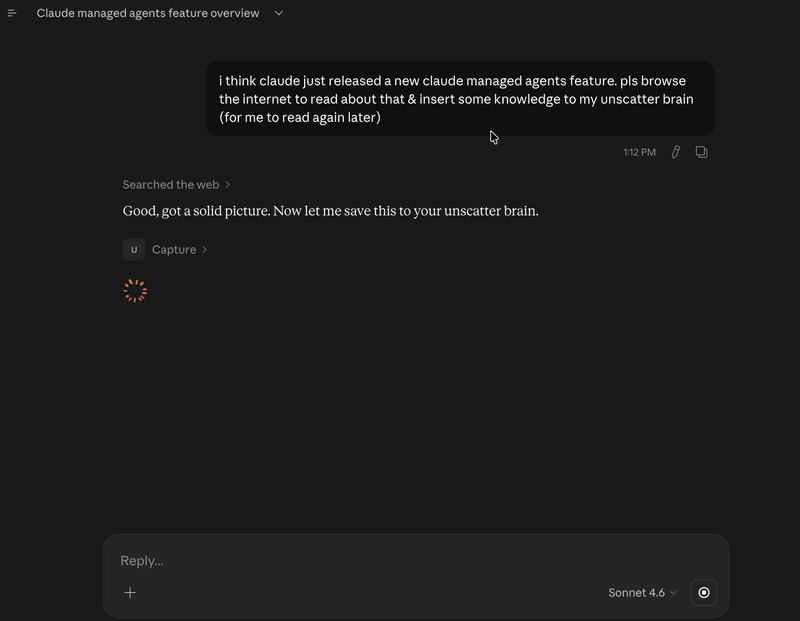
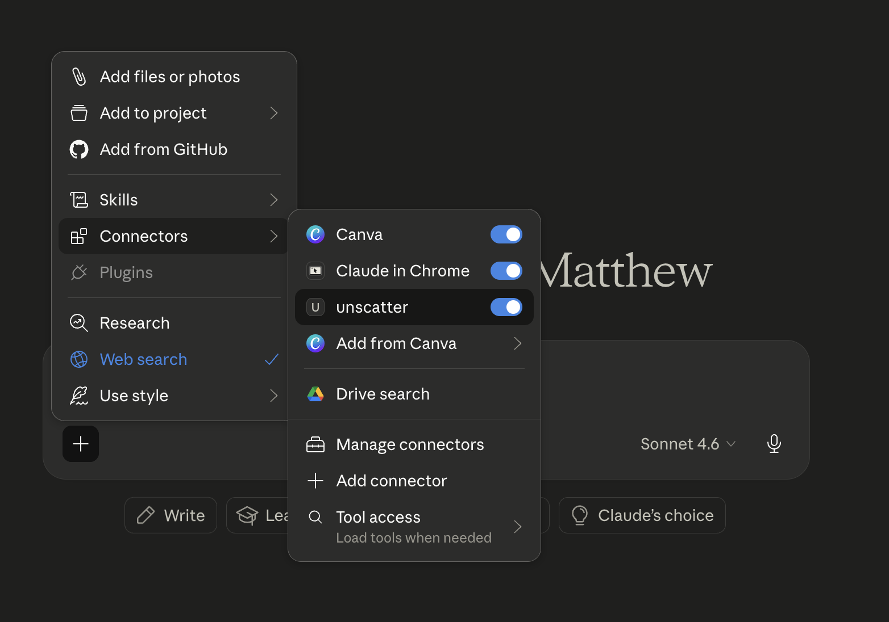
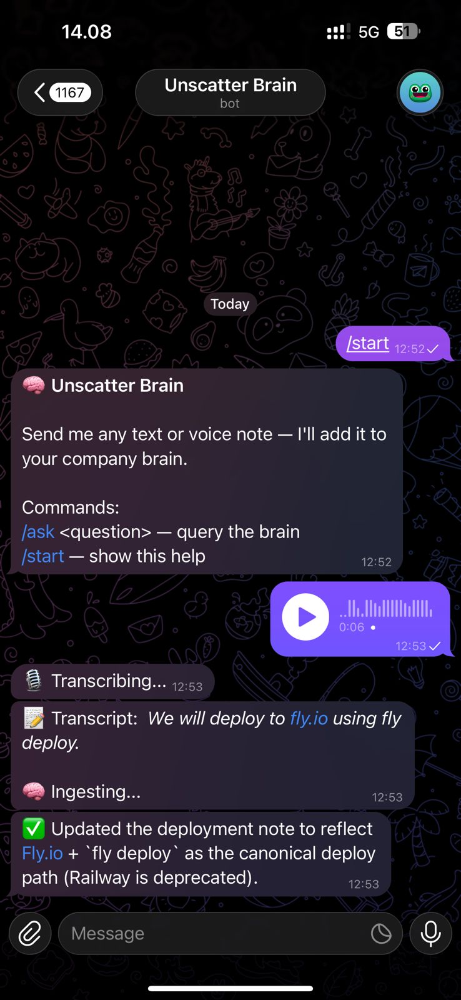
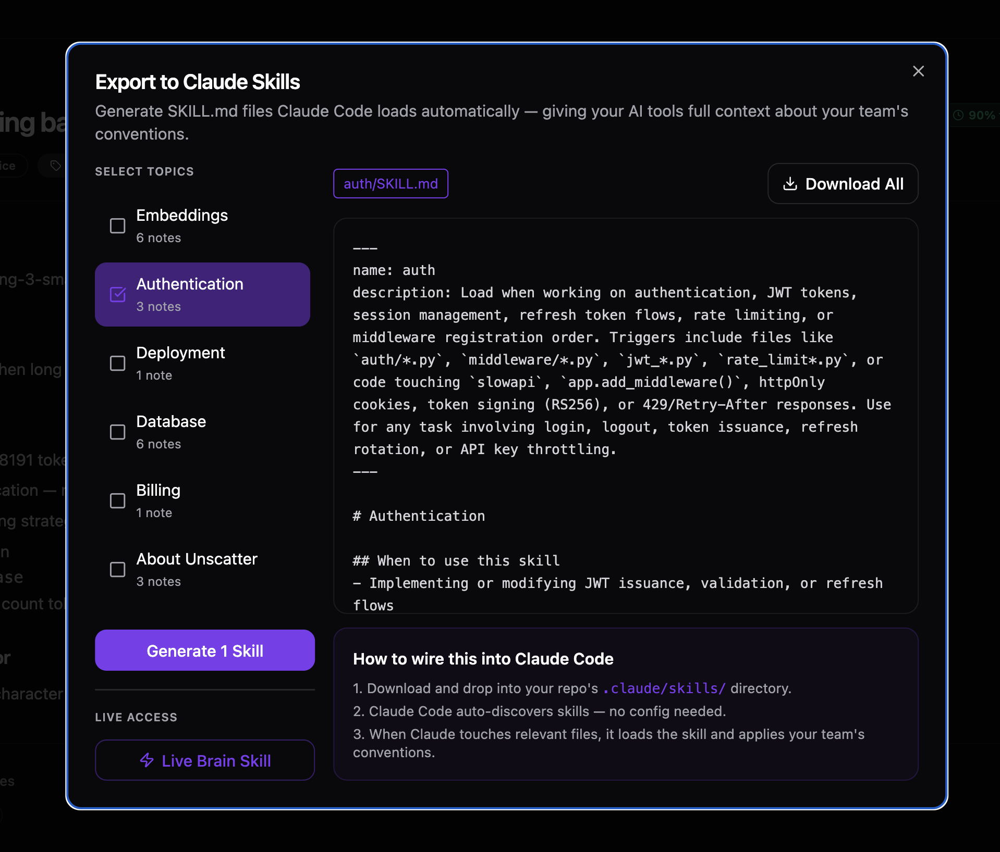

<p align="center">
  
</p>

<h1 align="center">Unscatter</h1>

<p align="center">
  <strong>Your team's knowledge, finally organized. Zero discipline required.</strong>
</p>

<p align="center">
  Dump a voice note. Type a thought. Drop a file. Claude turns it into a structured, queryable company brain — automatically.
</p>

<p align="center">
  <a href="https://www.linkedin.com/in/matthewfarant/">Built by Matthew Farant</a>
</p>

---



---

## Why Unscatter?

Most team knowledge lives in Slack threads, people's heads, and half-finished Notion docs nobody reads. Documentation tools assume you'll sit down and write. You won't.

There are four taxes that kill knowledge sharing: **discipline, writing, structure, and maintenance**. Every existing tool asks you to pay at least two of them. **Unscatter charges zero.**

Speak for 15 seconds from your menu bar. That's it. Claude handles the rest — deduplication, linking, organization, freshness tracking — while you stay in your flow.

---

## How It Works

```
Voice / Text / File  →  Claude INGEST  →  Structured Notes  →  Living Knowledge Graph
                                                    ↓
                                         Chat with citations
                                                    ↓
                                         Export as Claude Skills
```

Every dump goes through a single Claude call that:
- Deduplicates against existing notes
- Extracts atomic knowledge units
- Auto-links related notes
- Flags contradictions
- Updates freshness scores

No vector database. No embeddings infrastructure. Claude acts as the router, organizer, and retriever.

---

## Features

### 🎙️ Ambient Capture — Menu Bar App

The hero feature. A native macOS menu bar app (🧠 icon) lets you capture from **any app** without switching context.

**Voice capture:**
1. Click 🧠 → **Start Voice Capture** (icon turns 🔴)
2. Speak for 15 seconds
3. Click → **Stop & Ingest Voice**
4. Native macOS notification: *"Unscatter: Created 1 note about pgvector migration"*

**Screen recording:**
1. Click 🧠 → **Start Screen Recording** (icon turns 📹)
2. Record your screen — show the thing, talk through it
3. Click → **Stop Screen Recording**
4. A dialog appears: **"WHAT IS THE CONTEXT OF THIS SCREEN RECORDING?"** — type a sentence
5. Unscatter transcribes your narration + uses your context to ingest a structured note

Both modes require no browser. The brain grows from wherever you are.

> **Prerequisite for screen recording:** `brew install ffmpeg` — and grant Screen Recording permission in macOS System Preferences on first run.



---

### 🌐 Web UI — Browse, Chat, Explore

- **Wiki view** — auto-organized topic clusters with coverage indicators and freshness badges
- **Note detail** — full markdown rendering, related notes, freshness score, source modality
- **Chat panel** — always-visible, answers questions with inline `[note_id]` citations you can click
- **Correction flow** — type a correction in chat, Claude patches the source note in-place



- **Knowledge graph** — force-directed graph with 4 overlays: Coverage · Freshness · Connections · Onboarding Path



---

### 🤖 MCP Server — Live Brain in Claude Desktop & Claude Code

Unscatter ships an MCP server. Add it to Claude Desktop and your entire brain becomes available as tools:

```
query_brain("why are we using pgvector?")
→ "We switched from Pinecone because our corpus is under 500k vectors... [note_db003]"

capture("JWT tokens expire in 15min, refresh tokens in 7 days")
→ "Created 1 note: JWT session lifetime matches legal requirements"

list_topics()
→ Embeddings, Auth, Deployment, Database, Billing, Email
```



Enable it in Claude Desktop under **+ → Connectors → unscatter**:



---

### 📱 Telegram Bot — Mobile Capture

Send a text or voice note to your Telegram bot from anywhere. It transcribes, ingests, and confirms — same pipeline as the web UI.

```
You:  "We will deploy to Fly.io using fly deploy"
Bot:  🎙️ Transcribing...
Bot:  ✅ Updated the deployment note to reflect Fly.io + `fly deploy` as the canonical deploy path.

/ask why do we use pgvector?
Bot:  pgvector keeps vector search inside Postgres, eliminating a separate managed service...
```



#### Setting up your Telegram bot

**1. Create the bot with BotFather**

Open Telegram and message [@BotFather](https://t.me/BotFather):
```
/newbot
```
Follow the prompts — choose a name and username. BotFather gives you a token like:
```
123456789:AAFxxxxxxxxxxxxxxxxxxxxxxxxxxxxxx
```

**2. Get your Telegram user ID**

Message [@userinfobot](https://t.me/userinfobot) — it replies with your numeric user ID (e.g. `987654321`). This is what `TELEGRAM_ALLOWED_USER_IDS` is set to — only you can talk to your bot.

**3. Add to `.env`**

```
TELEGRAM_BOT_TOKEN=123456789:AAFxxxxxxxxxxxxxxxxxxxxxxxxxxxxxx
TELEGRAM_ALLOWED_USER_IDS=987654321
```

Multiple allowed users: comma-separated — `TELEGRAM_ALLOWED_USER_IDS=111,222,333`

**4. Run the bot**

```bash
venv/bin/python telegram/telegram_bot.py
```

The bot is now live. Send it a voice note or text from Telegram — it ingests straight into your brain.

---

### 📤 Export to Claude Skills

Generate `SKILL.md` files from any topic cluster. Drop them into `.claude/skills/` and Claude Code gains your team's full conventions — automatically loaded when relevant.

Two export modes:
- **Static export** — generates a snapshot SKILL.md per topic
- **Live Brain Skill** — generates a SKILL.md that uses MCP tools for real-time brain access



---

## Architecture

**Local-first. No database. No auth. No cloud.**

```
brain/
├── index.json          # AI-maintained master index (topics, edges, onboarding path)
└── notes/
    ├── note_abc123.md  # Atomic knowledge units with YAML frontmatter
    └── ...
```

Every note is a markdown file with structured frontmatter (`id`, `title`, `type`, `topics`, `freshness_score`, `related_notes`). The JSON index is the graph — nodes and edges maintained by Claude on every ingest. No vector DB, no embeddings, no infra.

**AI design: one Claude call per task.** Five distinct prompts handle the entire product:

| Prompt | Trigger | What Claude returns |
|---|---|---|
| INGEST | User dumps content | `create_note`, `update_note`, `add_edge`, `flag_contradiction` operations |
| CHAT ROUTER | User asks a question | `relevant_note_ids[]` (index-only, cheap) |
| CHAT ANSWER | After routing | Answer with inline `[note_id]` citations |
| EDIT | User corrects a fact | Full updated note body |
| EXPORT | Skill generation | Raw SKILL.md content |

**Retrieval = AI-as-router.** The index (small JSON) goes to Claude, Claude returns note IDs, backend loads those notes, second Claude call answers. No embedding infrastructure needed.

---

## Tech Stack

| Layer | Technology |
|---|---|
| Backend | FastAPI + Python 3.11 |
| AI | Anthropic Claude (claude-opus-4-7) |
| Transcription | Groq Whisper (whisper-large-v3-turbo) |
| Frontend | React + Vite + shadcn/ui (Luma, dark) |
| Graph | react-force-graph-2d |
| Menu bar | rumps + sounddevice |
| Telegram | python-telegram-bot v20 |
| MCP | mcp Python SDK (FastMCP) |
| Storage | Local markdown files + JSON index |

---

## Quick Start

### Prerequisites
- An [Anthropic API key](https://console.anthropic.com/)
- A [Groq API key](https://console.groq.com/) (free tier is fine)

### Option A — Docker (recommended)

Requires [Docker Desktop](https://www.docker.com/products/docker-desktop/).

```bash
git clone https://github.com/your-username/unscatter
cd unscatter

cp .env.example .env
# Edit .env — add ANTHROPIC_API_KEY and GROQ_API_KEY

docker compose up --build
```

- Backend: [http://127.0.0.1:8000](http://127.0.0.1:8000)
- Frontend: [http://localhost:5173](http://localhost:5173)

Your `brain/` directory is mounted as a volume — notes persist across restarts.

> **Menu bar app** runs outside Docker (macOS only). See Option B step 4.

---

### Option B — Manual Setup

Requires Python 3.11+ and Node.js 18+. macOS required for the menu bar app; web UI works on any OS.

### 1. Clone & configure

```bash
git clone https://github.com/your-username/unscatter
cd unscatter

cp .env.example .env
# Edit .env and add your API keys
```

`.env`:
```
ANTHROPIC_API_KEY=sk-ant-...
GROQ_API_KEY=gsk_...
BRAIN_PATH=./brain
CLAUDE_MODEL=claude-opus-4-7
```

### 2. Backend

```bash
python3 -m venv venv
source venv/bin/activate

pip install -r requirements.txt

venv/bin/uvicorn backend.main:app --reload --port 8000
```

### 3. Frontend

```bash
cd frontend
npm install
npm run dev
```

Open [http://localhost:5173](http://localhost:5173).

### 4. Menu bar app (macOS)

```bash
# ffmpeg is required for screen recording
brew install ffmpeg

pip install rumps sounddevice soundfile numpy requests
venv/bin/python menubar/menubar_app.py
```

Look for 🧠 in your macOS menu bar. Two capture modes are available:
- **Start Voice Capture** — mic only, instant ingest
- **Start Screen Recording** — records screen + voice, then prompts for context before ingesting

First run will prompt for microphone permission (voice) and Screen Recording permission (screen) — grant both.

### 5. Telegram bot (optional)

1. Message `@BotFather` on Telegram → `/newbot` → copy the token
2. Message `@userinfobot` → copy your numeric user ID
3. Add to `.env`:
   ```
   TELEGRAM_BOT_TOKEN=...
   TELEGRAM_ALLOWED_USER_IDS=123456789
   ```
4. Run:
   ```bash
   venv/bin/python telegram/telegram_bot.py
   ```

### 6. MCP server (Claude Desktop)

Add to `~/Library/Application Support/Claude/claude_desktop_config.json`:

```json
{
  "mcpServers": {
    "unscatter": {
      "command": "/absolute/path/to/unscatter/venv/bin/python",
      "args": ["/absolute/path/to/unscatter/mcp_server/server.py"],
      "env": {
        "ANTHROPIC_API_KEY": "sk-ant-...",
        "GROQ_API_KEY": "gsk_...",
        "BRAIN_PATH": "/absolute/path/to/unscatter/brain"
      }
    }
  }
}
```

Restart Claude Desktop. The Unscatter tools appear under **+ → Connectors → unscatter**. Ask it: *"Use the query_brain tool to ask: what's our deployment setup?"*

---

## API Reference

| Method | Endpoint | Description |
|---|---|---|
| `POST` | `/api/ingest` | Run Claude INGEST pipeline on raw text |
| `POST` | `/api/capture/voice` | Transcribe audio via Groq Whisper |
| `POST` | `/api/capture/file` | Extract text from PDF or txt |
| `GET` | `/api/brain/index` | Full index.json |
| `GET` | `/api/brain/notes/{id}` | Single note content |
| `GET` | `/api/brain/graph` | Graph nodes + edges |
| `POST` | `/api/chat` | Two-phase routed chat with citations |
| `POST` | `/api/chat/apply_correction` | Patch a note from a user correction |
| `GET` | `/api/export/topics` | List all topics |
| `POST` | `/api/export/skills` | Generate SKILL.md per topic |
| `GET` | `/api/export/live-skill` | Generate live MCP-connected SKILL.md |
| `GET` | `/api/daemon/ping` | Menu bar heartbeat |

---

## Project Structure

```
unscatter/
├── backend/
│   ├── main.py              # FastAPI app
│   ├── config.py            # Env loading
│   ├── models.py            # Pydantic models
│   ├── routes/              # capture, ingest, brain, chat, export
│   ├── services/
│   │   ├── brain_io.py      # Read/write notes + index (atomic writes)
│   │   └── claude_client.py # call_claude() + parse_claude_json()
│   └── prompts/             # ingest, chat_router, chat_answer, edit, export
├── frontend/
│   └── src/components/      # TopBar, Sidebar, WikiView, GraphView,
│                            # ChatPanel, CaptureModal, ExportModal,
│                            # NoteDetailView
├── mcp_server/
│   └── server.py            # FastMCP server — query_brain, get_note,
│                            #   list_topics, capture
├── menubar/
│   └── menubar_app.py       # rumps macOS menu bar app
├── telegram/
│   └── telegram_bot.py      # Telegram bot (text + voice + /ask)
└── brain/
    ├── index.json           # AI-maintained graph index
    └── notes/               # Markdown knowledge notes
```

---

## Design Decisions

**Why no vector database?** Claude acts as the router. Send it the index (small JSON, ~10KB), it returns note IDs, the backend loads those notes. This is smarter than keyword search, requires zero infra, and is easier to debug. For a brain up to ~500 notes it's faster than setting up and querying a vector DB.

**Why markdown files?** Portable, git-friendly, Claude-native. You can `cat` a note, `grep` across the brain, and version-control the whole thing. No schema migrations ever.

**Why one Claude call per task?** Simpler to debug, easier to tune, faster to iterate. Multi-agent orchestration adds complexity without meaningful benefit at this scale.

**Why a menu bar app instead of a hotkey?** macOS accessibility permissions for global hotkeys are brittle, silently fail without them, and break in certain terminal contexts. A menu bar app needs only microphone permission, is always visible, and is demo-reliable.

---

## Roadmap

- Multi-user support with team auth
- Slack / WhatsApp / email auto-capture
- Meeting bot integration (auto-ingest transcripts)
- Vector search alongside AI router for large brains (>1k notes)
- Auto-generated PRs to update repo `CLAUDE.md` files
- Browser extension for web page capture
- Versioning / time-travel through brain history

---

## License

MIT
